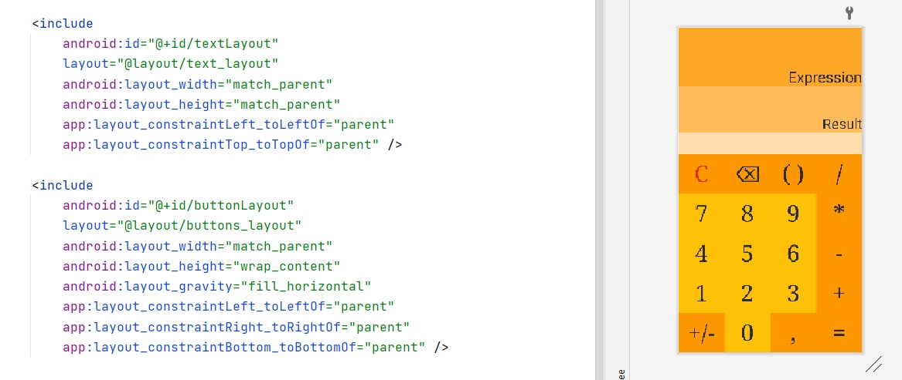
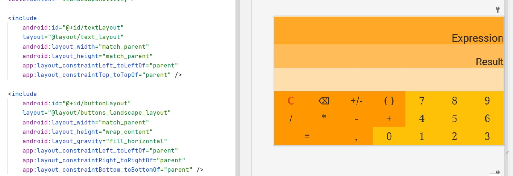
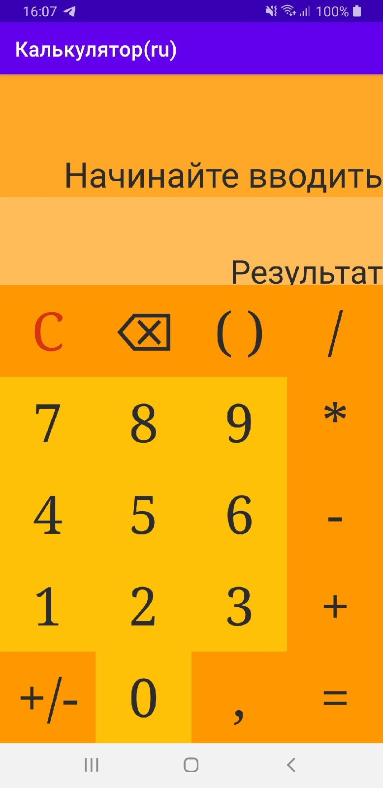
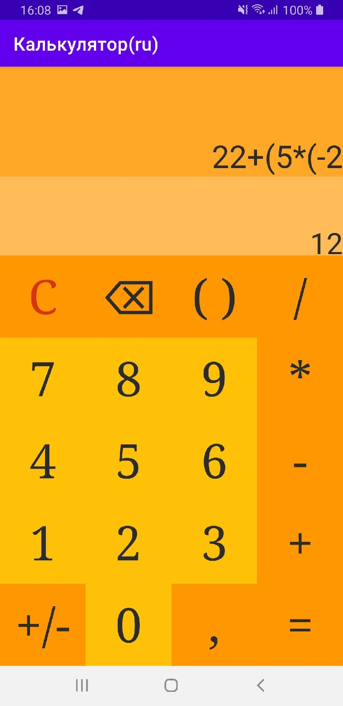
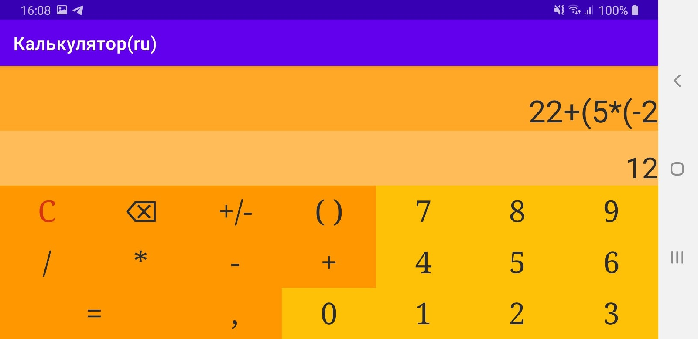
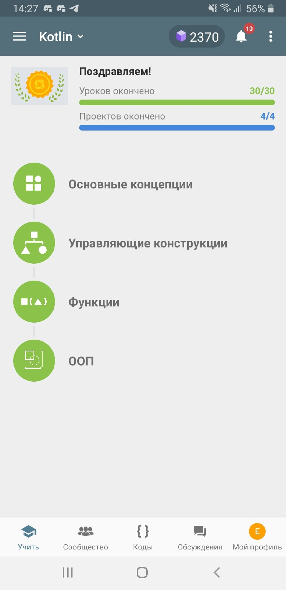

# Калькулятор на Android (kotlin)

---
В рамках первой лабораторной работы было разработано приложение "Калькулятор" под ОС Android

Приложение высчитывает значение выражения, которое пользователь ввел нажимая на кнопки. 
Предусмотрены такие операции как *сложение*, *вычитание*, *умножение*, *деление*, 
операции со *скобками*, операции с *отрицательными числами* и *дробными числами*.
Для удаления введенных символов можно воспользоваться соответствующими кнопками.

Приложение имеет привычный интерфейс.

Пользователь нажимает на кнопки, результат попадает на экран и записывается в строку. 
Выражение из этой строки вычисляется на основе **обратной польской записи** 
в [соответствующем классе](./java/com/example/calculator/ReversePolishNotation.kt). 
Строка, введенная пользователем, преобразуется в форму полльской записи, 
на ее основе высчитывается выражение и выводится результат.
Для безопасного выполнения Приложение контролирует весь 
ввод пользователя. Например, нельзя ввести "000000", "+++-+-+", 
"/0" (однако можно ввести /0.0001, например) и т.д. За этим следит 
[класс-обработчик](./java/com/example/calculator/HandlerClass.kt).

Для удобства предусмотрены различные варианты автодополнения ввода. Например, 
если нажать *9* и *(* ,то вместо " 9( " будет выведено " 9*( ", или например, 
если после мат.операции нажать запятую, то автоматически подставится " *0.* ".
Пользователю также нет необходимости заботится о закрытии скобок (приложение
само доставит скобки) или о нажатии кнопки "равно" (приложение автоматически 
пересчитывает выражение после каждого нажатия)
В качестве вдохновения был взят уже установленный  на смартфоне системный калькулятор,
который имел такие функции.

---
Приложение состоит из 2-х activity и 5-ти layout-файлов. 

Activity для portable и landscape варианта приложений запускаются от поворота 
устройства (по умолчанию запускается вариант portable). Это выполнено 
переопределением функции 
    
    override fun onConfigurationChanged(newConfig: Configuration)
в которой мы передаем строки для сохранения и запускаем другую activity.

Для сохранения состояния также предусмотрены и

    override fun onSaveInstanceState(outState: Bundle, outPersistentState: PersistableBundle)
     и    
    override fun onRestoreInstanceState(savedInstanceState: Bundle)

Обе activity имеют схожий код

---
Оба основных layout состоят из двух блоков: блока кнопок и блока текстовых полей. 
Блок текстовых полей имеет одинаковый дизайн, поэтому он один на оба layout-а.
Блоки кнопок же отличаются дизайном и поэтому для них были созданы разные layout-ы.

---

---
В приложении предусмотрена локализация для Ru и En (Строки ввода/результата и название)
[Английские](./res/values-en/strings.xml) и [руссике](./res/values-ru/strings.xml) версии строк соответственно.

---
---
### Пример локализации:

### Пример сохранения информации, автодоподнения, автосчета:

---

---

Upd. Курс на sololern был пройден до первой лабороторной работы, на которой вы сказали о содержалии фамилии в никнейме. Никнейм "Endimion". 
Проходил в мобильном приложении. Вот [сертификат](https://www.sololearn.com/certificates/course/en/16304960/1160/landscape/png)  https://www.sololearn.com/certificates/course/en/16304960/1160/landscape/png

